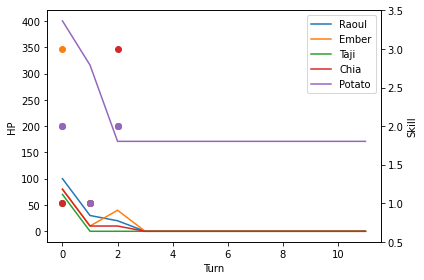
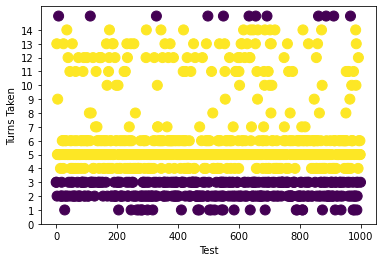
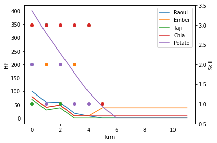
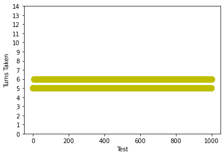
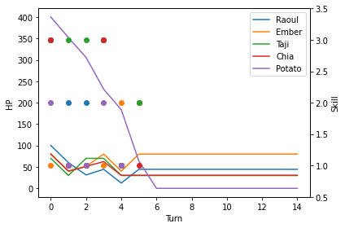
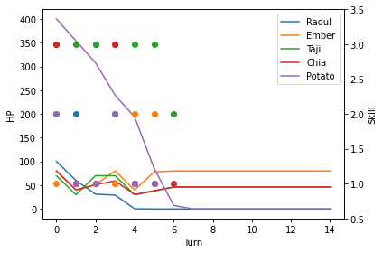

# Ambrosia - Boss Balancing

## The Goal
######  Potato Boss is designed to require strategy to defeat. It should be difficult with random actions but do-able with the right strategy. Using Python scripting and simulated AI, we will prove that the theoretical concepts we used to balance HP and damage numbers actually enforce the results we desire.

------------

## The Simulation
> `data\balancing\balancing.py`  

This script encodes the following:
- Player AI
  - All effects and all stats are included
  - Includes HP shields, stuns, damage buffs, and damage debuffs 
  - Includes enemy targetting to simulate "nearest" enemy and "AoE"
  - Attempts to simulate enemy and player positioning by affecting ranged skills with an RNG-factor that determines how many targets are within range of the skill
  
- Enemy AI
  - Only the potato boss for now, but can be expanded for more enemies
  - All effects and all stats are included
  - Includes the in-game Potato AI, whereby he uses his Ultimate once on the first turn and once more on the first time his HP drops below 50%
  
- Player Strategy Simulations
  - Randomized Action - all skills chosen by players are completely random each turn
  - Strategic Action - some basic strategy is enforced, such as Chia using her HP shield skill whenever the Potato will use his ultimate
  - Super Strategic Action - more advanced strategy is enforced, such as increasing the probability of using certain skills depending on how many ultimates the Potato has yet to left

## Testing Method
For each of the 3 strategy types, 1000 "games" up to a maximum of 15 turns are stimulated (if the game has not been won by the 15th turn, it is considered a defeat). This is repeated 5 times to obtain the Average Victory Rate per strategy (ie. 1 batch = 1000 games, and we run 5 batches per strategy type)

------------

## Results
### Random action is not effective.
Randomly selecting player skills each turn did not lead to many victories.

5-batch Victory Rates: 21.0%, 18.3%, 19.2%, 20.4%, 16.8%  
Average Victory Rate: 19.1%

  
*Win rate over 1000 games - Yellow indicates victories, purple indicates defeat.*

What happened?
- If Chia does not use her HP shield, Taji is 1HKO'd on Turn 1 and everyone else is reduced to unsustainably low HP
- Without Taji's third skill, healing is also reduced
- All other players are wiped out by Potato's 2nd ultimate

  
*HP and Skill use per entity in 1 game - Taji (green) immediately dies on turn 1. Other players are defeated upon the Potato's 2nd ultimate (Skill 2)*

### There exists a simple effective strategy.
The simplest strategy is to use Chia's HP shield before the boss ults. This is on Turn 1 and the first time the boss drops below 50% HP. All other behaviour is random.

5-batch Victory Rates: 65.7%, 68.1%, 63.4%, 64.9%, 68.1%  
Average Victory Rate: 66%

  
*Win rate over 1000 games - Yellow indicates victories, purple indicates defeat.*

What happened?
- Chia's HP shield enables everyone to stay alive from the first ultimate
- Raoul, who usually tank's Potato's normal melee skill, is particularly healthy which helps sustain everyone else
- The game is relatively close after that, as the player AI is mostly still random
- The game is also prolonged as some players die due to insufficient healing, resulting in decreased DPS and a fake "Defeat" due to exceeding maximum simulation turns

  
*HP and Skill use per entity in 1 game - victories are relatively close, with many players at low HP. In this game, Chia shielded (Skill 3, red) every single turn until the last turn.*  

### There exists a near-perfect strategy.
The intended advanced strategy ALWAYS leads to victory within 6 turns. This is proof of concept for our theoretical mechanics and also reflects what we see when we play the game ourselves.  

5-batch Victory Rates: 100%, 100%, 100%, 100%, 100%  
Average Victory Rate: 100%

  
*Win rate over 1000 games - All games are won by the 6th turn.*

What the secret strategy?
- Use Chia's HP shield to mitigate boss's ultimate
- **minimize** damage output before the boss's second ultimate - this increases the time we have to heal up before he uses his ultimate again (at HP less than 50%)
- **focus healing** and buffing heals before the boss's second ultimate
- maximize damage output after the boss has used all his ultimates  

  
*HP and Skill use per entity in 1 game - Ember minimized her damage with skill 1 until Potato's second ult, while Taji and Chia prioritized healing and shielding with skills 1 and 3. Raoul chooses between a low-damage third skill and a buff skill (which also buffs heals in this simulation) until the Potato's second ult. After the Potato ults, all players prioritize maximum damage.*

However, even the perfect strategy has a caveat: not all players survive each victory. Beating the boss with *all players alive*  is complicated and sometimes requires positioning and aggro-swapping (ie. making Raoul move back and letting Ember tank when his HP is too low), which is difficult to simulate in code.

  
*In this game, Raoul died before the game was won.*

------------

## Conclusion
Without a strategy, the boss is difficult - Potato **does** require mechanics. With the correct strategy, it is relatively easy. Beating the boss with *all players alive*  is still a challenge and requires some slightly "creative" mechanics. Thus, we have the opportunity for advanced achievements such as "Defeat the Potato with all players alive" for the hardcore players, while still ensuring beginners are able to defeat the potato eventually with some hints and some practice. 

This is proof of concept for the theory we used when designing the Potato boss and balancing HP and damage numbers. As we use similar rationale to design other bosses and enemies, this experiment supports the idea that our theoretical concepts transition well into actual gameplay.
